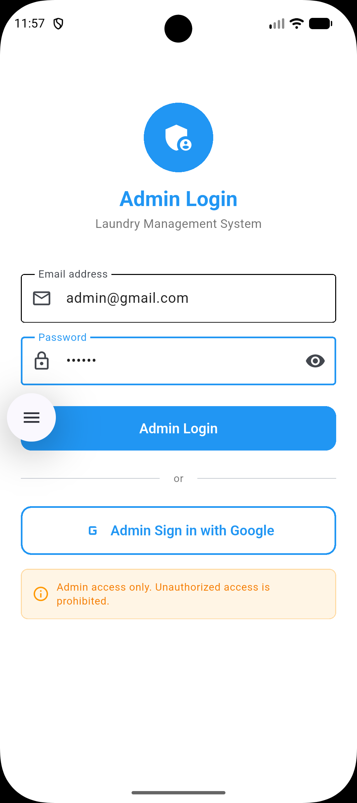
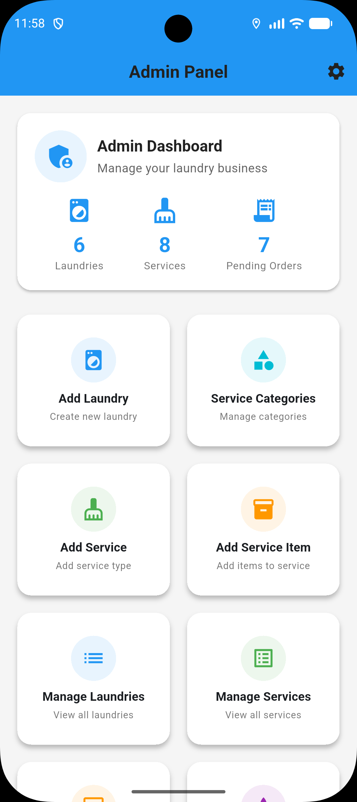
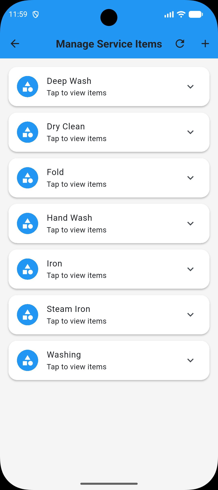
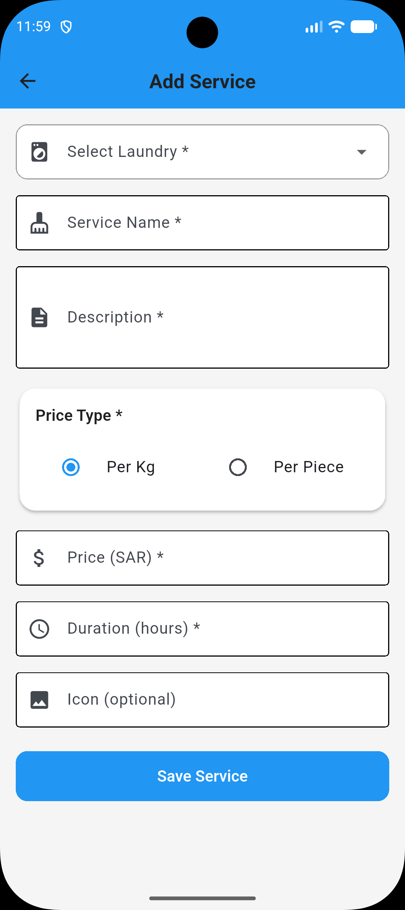
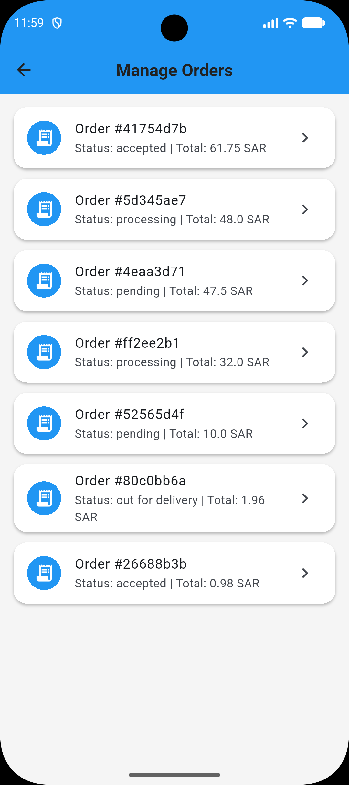
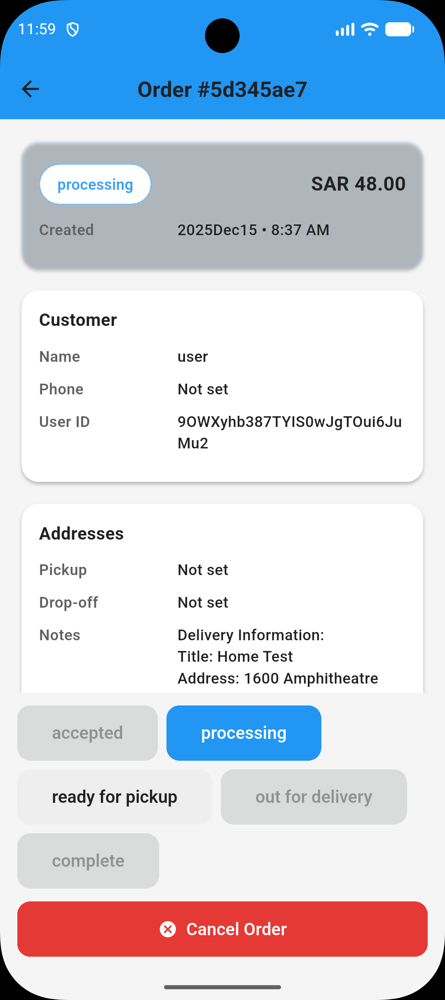
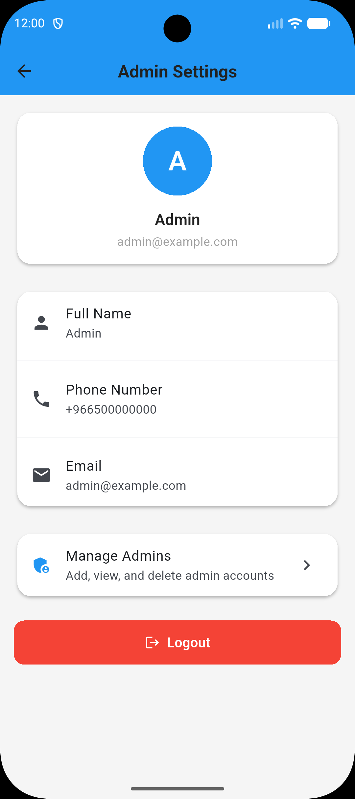
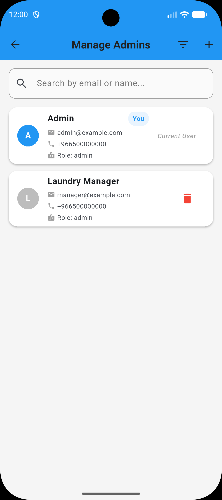

# 🧑‍💼 Laundry App – Admin Dashboard (Flutter & Firebase)

The **Laundry App Admin Dashboard** is a powerful back-office application built with **Flutter & Firebase** that allows administrators to manage the complete laundry service ecosystem in real time.
It works seamlessly with the **Laundry Customer Mobile App** and is extendable for a **Driver App**.

---

## 🔗 Related Application

### 📱 Laundry Customer App

👉 **GitHub Repository:**
[https://github.com/amiraslam327/laundry-app]

This admin dashboard controls and manages all data used by the customer-facing laundry application, including laundries, services, pricing, discounts, and orders.

---
## 📱 App Screenshots

<p align="center">
  
  
  
</p>

<p align="center">
  
  
  
</p>

<p align="center">
  
  
</p>

---
## 🎯 Purpose of Admin Dashboard

* Centralized control of laundries, services, and orders
* Real-time business operations monitoring
* Pricing, discount, and availability management
* Smooth order lifecycle from pickup to delivery

---

## 🚀 Core Features

### 🔐 Admin Authentication & Roles

* Firebase Authentication
* Admin & Super Admin roles
* Secure access control
* Persistent sessions

---

### 🏪 Laundry Management

* Add, edit, delete laundries
* Set working hours & open/close status
* Preferred laundry selection
* Discount & minimum order control
* Google Maps location (lat/lng)

---

### 📦 Order Management

* View all customer orders
* Order statuses:

  * Pending
  * Accepted
  * In Progress
  * Completed
  * Cancelled
* Detailed order view (services, items, pricing)
* Order history & filtering

---

### 🧺 Services & Pricing

* Manage laundry services (Wash, Dry Clean, Fold, etc.)
* Per-item or per-weight pricing
* Enable / disable services
* Apply service-level discounts

---

### 👥 User Management

* View registered users
* User profile & address details
* Order history per user

---

### 🎯 Discounts & Offers

* Global discounts
* Laundry-specific offers
* Percentage-based pricing rules

---

### 🗺 Google Maps Integration

* Laundry location management
* Distance-based listing in customer app

---

### 🔥 Real-Time Firebase Sync

* Firestore real-time listeners
* Instant updates across admin & customer apps

---

## 🛠 Tech Stack

* Flutter (Dart)
* Firebase Authentication
* Cloud Firestore
* Firebase Storage
* Google Maps API
* Provider / Riverpod

---

## 📂 Project Structure

```
lib/
├── core/
│   └── config/
├── features/
│   ├── admin/
│   ├── auth/
│   └── common/
├── shared/
│   ├── data/
│   ├── domain/
│   ├── presentation/
│   └── utils/
└── main.dart
```

---

## 🔐 Firestore Collections

```
admins/
laundries/
orders/
users/
services/
discounts/
```

---

## 🔄 App Ecosystem

* 📱 **Customer App** → Place orders
* 🧑‍💼 **Admin Dashboard** → Manage operations

---

## 🚀 Future Enhancements

* Driver assignment system
* Push notifications (FCM)
* Analytics & reports
* Flutter Web admin panel

---

## 👨‍💻 Author

**Amir Aslam**
Flutter & Mobile Application Developer
📍 Saudi Arabia

🔗 GitHub: [https://github.com/amiraslam327](https://github.com/amiraslam327)

---

⭐ If you find this project useful, please **star the repository**.
